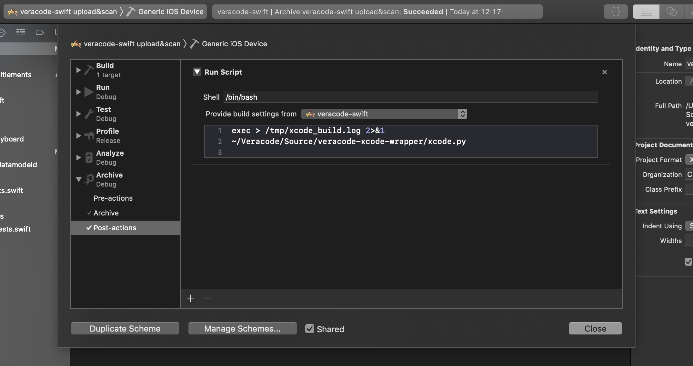

# Xcode Upload & Scan Utility

Clone this repo somewhere handy. Install the [Veracode Mobile Application Packager](https://help.veracode.com/reader/eAvornYxfrGF2caDJIBu_g/qUsaXhOwBuBQsnafuZ62dA), including command line tool. Download the [Veracode Java API wrapper](https://search.maven.org/search?q=a:vosp-api-wrappers-java) and put it somewhere handy too. Edit `xcode.py` to point to your jar file.

Set up API credentials in `~/.veracode/credentials`:

    [default]
    veracode_api_key_id = 359edffad5......
    veracode_api_key_secret = 09fafebf9e1f3490....

Set up an Xcode scheme as per usual [Veracode requirements](https://help.veracode.com/reader/4EKhlLSMHm5jC8P8j3XccQ/PJWz14TuPBwScC2EpJtB2Q). If you set up a scheme specifically for Veracode then you can choose when to use it, and thus when to start an upload & scan.

Add a post-action to the Archive settings:

Whenever you run an archive the Veracode package tool will create a BCA file and the wrapper will upload the BCA to Veracode for scanning.